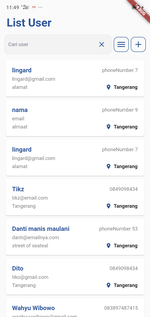
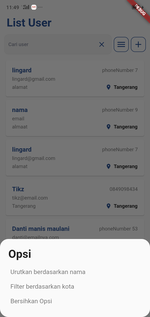
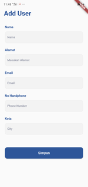

# Person Manager

## Getting Started

This project is a Person Manager

- clean architecture with [Bloc](https://https://pub.dev/packages/get)
- Rest API service with [DIO](https://pub.dev/packages/dio)
- Auto Route with [NAV ROUTER](https://github.com/chairilrafi11/nav_router)
- Loading screen with shimmer effect [SHIMMER](https://pub.dev/packages/shimmer)

For help getting started with Flutter, view
[online documentation](https://flutter.dev/docs), which offers tutorials,
samples, guidance on mobile development, and a full API reference.

## Development Setup
Clone the repository and run the following commands:
```
flutter pub get
flutter run
```

## Guide & Screenschoot

### Home


modern interface with simple material wigdet, all buttons are above the user list to make it visible and easier

Users can search for objects by name, address, email and phone number



also sort the list by name
filter object by city
clear current filter


loading screen shimmer when get response form api 

### Form 


simple but modern user data addition form. 

there is a form validation (user must fill in all data to be able to create)
